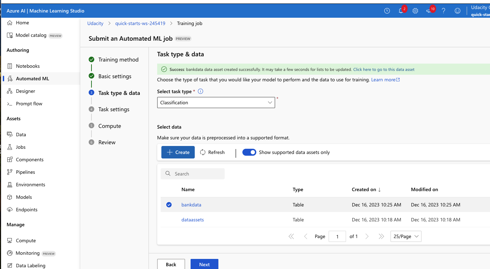

# Operationalizing Machine Learning

This is an end-to-end machine learning project on Microsoft Azure where I have configured a cloud-based machine 
learning production model, deployed, and consumed it.
The Bank Marketing Dataset was used and  trained a machine learning model leveraging the AutoML of 
Azure Machine Learning Studio, deployed it into the production using Azure Container Instance (ACI) and 
consumed it using REST endpoints.
Pipeline  was also created. published and consumed to automate the whole process.
## Architecture Diagram
The architectural diagram above shows the flow of operations from start to finish.


Each step  is described below:
1. Upload a dataset:  either using the URL or uploading directly from a local folder.
2. AutoML run is performd: This involves moments as setting up  configurations like compute cluster, type of machine learning task, exit criterion etc. AutoMl run trains different models on our dataset.
3. Deploy the best model: The best performing model  is selected from our AutoML run and deployed into production using Azure Container Instance (ACI) or Azure Kubernetes Service (AKS).
4. Enable logging : Logging helps monitor our deployed model. It helps us know the number of requests it gets, the time each request takes, etc.
5. Swagger Documentation : In this step, the deployed model uis consumed using Swagger.
6. Consume model endpoints :The endpointis interacted  using some test data to get inference results.
7. Create and Publish a Pipeline: Using the Azure Python SDK with the aid of a Jupyter Notebook, we can create and publish a pipeline. It is required that a config.json file to be present in the working directory. Using pipelines, we can automate the whole process of training and deploying our model. results.


## Key Steps


Authentication: When working on your own Azure account, you will need to install the Azure Machine Learning Extension which allows you to interact with Azure Machine Learning Studio, part of the az command. When the Azure machine Learning Extension is installed, Service Principal account has to be created  and associateed withyour specific workspace.  Service Principal Authentication is a preferred method for non-interactive environments, as it allows for scripted or automated processes to access Azure resources without the need for manual login each time .When working with the restricted workspace az login `az login --use-device-code`  is a workaround and should be performed.

Automated ML Experiment: In this step an AutoML run was configured and several models were trained on the Bank Marketing Dataset. This involves configuring a compute cluster, type of machine learning task etc. The best performing model is voting ensemble as shown below and was deployed.


#### Create AutoML run: 
classification job is created using loaded Banking Dataset.


#### AutoML run completed

The eperiment has been completed  and best model is shown and can be accessed.

The best model for this classification problem was a Voting Ensemble model with 0.94698 AUC metric.
Other metrics of the best model are shown below.


#### Metric Details


### Deployment


Deploy Best Model and Enable Logging:  The best model deployed Using Azure Container Instance (ACI) with Authentication enabled.
The model endpoints  enable other services to  interact with the deployed model. Authentication is enabled during deployment so keys are generated which other services can use to authenticate before interacting with our deployed model.
After deploying the  best model,Application Insights are enabled and retrieve logs.


### Endpoint


endpoint result

#### Loggings


#### Swagger
Swagger Documentation: Swagger is a tool to build, and document REST APIs. It can be used to share documentation among product managers, testers, and developers and can also be used by various tools to automate API-related processes.

Azure provides a swagger.json URL that can be used to create a web site that documents the HTTP endpoint for a deployed model. Here we consumed our deployed model using swagger and displayed the contents of the API for the model as shown below.

To consume our best AutoML model using Swagger, the swagger.json file provided in the endpoints section of Azure Machine Learning Studio is downloaded. 

Run the swagger.sh and serve.py files to be able to interact with the swagger instance running with the documentation for the HTTP API of the model.


### Create, Publish, and Consume a Pipeline: Here we use the Azure Python SDK 


#### Best Model: Prefitted SoftVoting Classifier.


#### Publishing a pipeline


#### Results of a Pipeline run


### Benchmarking
AutoML Classifier


## Screen Recording


Skärminspeln 2024-01-26 kl. 15.18.01_udacity_pr2.mov
https://youtu.be/zeurhd1PDl0


```python

```
